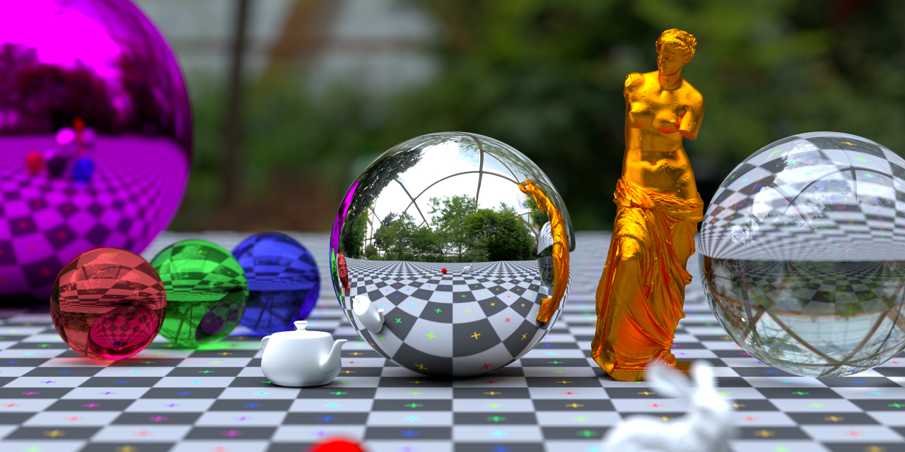

# 1. Raytracer

The repository for the project Raytracer.



---  

## 2. How to launch

To run the project:

```sh
> make
> ./raytracer <SCENE_FILE>
```

---  

## 3. The purpose of the project

Ray tracing is a technique used to generate realistic digital images by simulating the inverse path of light.
Your goal is to create a program able to generate an image from a file describing the scene.

---  

## 4. People on the project

| [<br><sub>Cyprien Nguyen-Van-Vien</sub>](https://github.com/Cyprien-nguyen-van-vien) | [<br><sub>Damien Benais-Captal</sub>](https://github.com/damienBC) | [<br><sub>Pierre-Louis Leroy</sub>](https://github.com/Pierrelouisleroy) | [<br><sub>Virgile Berrier</sub>](https://github.com/Lipatant)
| :--: | :--: | :--: | :--: |
