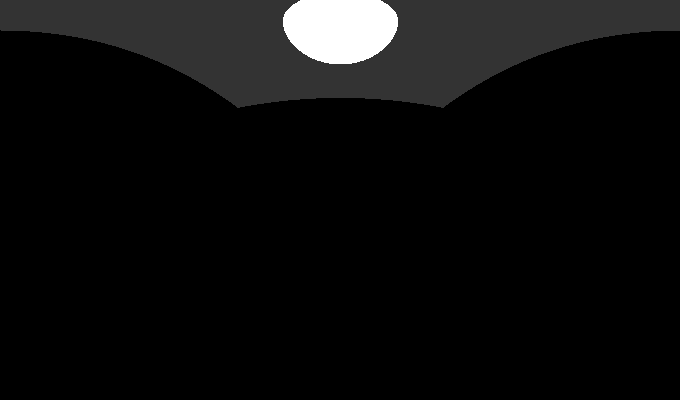
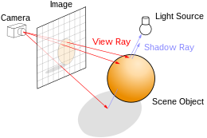
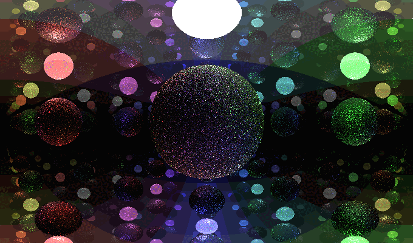
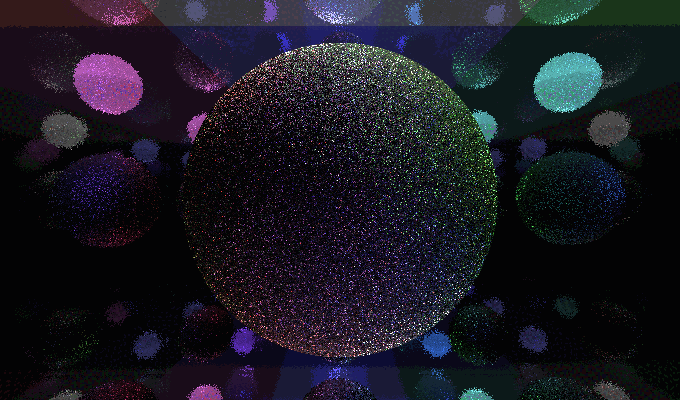

# Raytracer - Epitech Project

The repository for the Raytracer project.




---


## Table of contents

[1. The purpose of the project](#titre1)<br />
[2. How to use Raytracer](#titre2)<br />
[3. How to launch](#titre3)<br />
[4. People on the project](#titre4)<br />


---


## <a id="titre1"></a>1. The purpose of the project

Raytracing is a 3D rendering technique used in computer graphics.

This technique consists of simulating the propagation of light in a virtual scene by tracing light rays from the
camera or a light source and calculating their interaction with the objects in the scene.

The result is a realistic image with very realistic light effects, reflections, refractions and shadows.

Your goal is to create a program able to generate an image from a file describing the scene.

Duration: one month
Language: C++
group number: 3-4





---


## <a id="titre2"></a>2. How to use Raytracer

To use Raytracer you need a configuration file like the following:

```cpp
scene =
{
    camera = {
        posx = -1.9;
        posy = 0.0;
        posz = 0.0;
        angle1 = 0;
        angle2 = 0;
    };
    shapes = (
        {
            shape = "sphere";
            x = 0;
            y = 0;
            z = 2;
            radius = 0.5;
            color = "1 1 1";
            light = "1 1 1 1.0";
        },
        {
            shape = "sphere";
            x = 0;
            y = 0;
            z = 0;
            radius = 0.8;
            rgb = "1 1 1 0.2";
        },
        {
            shape = "plane";
            x = 0;
            y = 0;
            z = 2;
            vectx1 = 1;
            vecty1 = 0;
            vectz1 = 0;
            vectx2 = 0;
            vecty2 = 1;
            vectz2 = 0;
            color = "1.0 1.0 1.0";
            light = "1.0 1.0 1.0 0.2";
            mirror = 0.98;
        },
        {
            shape = "plane";
            x = 0;
            y = 0;
            z = -2;
            vectx1 = 1;
            vecty1 = 0;
            vectz1 = 0;
            vectx2 = 0;
            vecty2 = 1;
            vectz2 = 0;
            rgb = "1 1 1";
            mirror = 0.98;
        },
        {
            shape = "plane";
            x = 2;
            y = 0;
            z = 0;
            vectx1 = 0;
            vecty1 = 1;
            vectz1 = 0;
            vectx2 = 0;
            vecty2 = 0;
            vectz2 = 1;
            rgb = "0.5 0.5 1.0";
            mirror = 0.98;
        },
        {
            shape = "plane";
            x = -2;
            y = 0;
            z = 0;
            vectx1 = 0;
            vecty1 = 1;
            vectz1 = 0;
            vectx2 = 0;
            vecty2 = 0;
            vectz2 = 1;
            rgb = "1.0 1.0 1.0";
            mirror = 0.98;
        },
        {
            shape = "plane";
            x = 0;
            y = -2;
            z = 0;
            vectx1 = 1;
            vecty1 = 0;
            vectz1 = 0;
            vectx2 = 0;
            vecty2 = 0;
            vectz2 = 1;
            rgb = "1.0 0.5 0.5";
            mirror = 0.98;
        },
        {
            shape = "plane";
            x = 0;
            y = 2;
            z = 0;
            vectx1 = 1;
            vecty1 = 0;
            vectz1 = 0;
            vectx2 = 0;
            vecty2 = 0;
            vectz2 = 1;
            rgb = "0.5 1 0.5"
            mirror = 0.98;
        }
    );
};
```

When creating the camera, you must define:

>- The coordonates of the camera (posx, posy and posz)
>- The angle of the camera (angle1, angle2)

You could also define:

>- the field of view (fov)

When creating a shape, you must define:

>- The shape
>- its coordinates (x, y and z, all doubles)
>- its texture. Depending on the shape, it can be:
>- >- a color defined with 'color'
>- >- a texture defined with:
>- >- >- a color (rgb/rgba)
>- >- >- a color and a light (rgb/rgba)
>- >- >- a color, a light and a mirror value (double)

list of the available shapes:

>- sphere
>- plane
>- triangle
>- ambiant_light/ambiantLight/ambiant/light
>- directional_light/directionalLight/directional
>- object

When creating a sphere, you must also define:

>- the radius (double)

When creating a plane, you must also define:

>- the size of the plane via two vectors:
>- >- first vector defined like this:
>- >- >- vectx1
>- >- >- vecty1
>- >- >- vectz1
>- >- second vector defined like this:
>- >- >- vectx2
>- >- >- vecty2
>- >- >- vectz2

When creating a triangle, you must also define:

>- the size of the plane via two points:
>- >- first point defined like this:
>- >- >- x1
>- >- >- y1
>- >- >- z1
>- >- second point defined like this:
>- >- >- x2
>- >- >- y2
>- >- >- z2

When creating an ambiant light, you must also define:

>- The color (rgb/rgba, or a texture)

When creating a directional light, you must also define:

>- The color (rgb/rgba, or a texture)
>- the direction (x, y and z)

When creating an object, you must define:

>- the path of the file (path/to/object.obj)

You can also define a group which contains lany of these shapes using group.

Warning: if the shape is not defined or invalid, the program will fail!
Warning: each undefined value will be replaced by a default value !


---


## <a id="titre3"></a>3. How to launch

To run the project:


```sh

> make
> ./raytracer <SCENE_FILE> with argument

```

The arguments to return which are the following:

--blending or -b for Blending, which overlays the scene possibilities



--fov or -f for Field Of View, which changes the fov of the scene



--height or -h for Height, which changes the size we want for our scene


--width or -w for Width, which changes the width of our scene


--out or -o for Out, which changes the output file name

--rebound or -r for Rebound, which changes the number of bounce of the light


## <a id="titre4"></a>4. Contributors

| [<br><sub>Cyprien Nguyen-Van-Vien</sub>](https://github.com/Cyprien-nguyen-van-vien) | [<br><sub>Damien Benais-Captal</sub>](https://github.com/damienBC) | [<br><sub>Pierre-Louis Leroy</sub>](https://github.com/Pierrelouisleroy) | [<br><sub>Virgile Berrier</sub>](https://github.com/Lipatant)
| :--: | :--: | :--: | :--: |

cyprien.nguyen-van-vien@epitech.eu
damien.benais-captal@epitech.eu
pierre-louis.leroy@epitech.eu
virgile.berrier@epitech.eu
